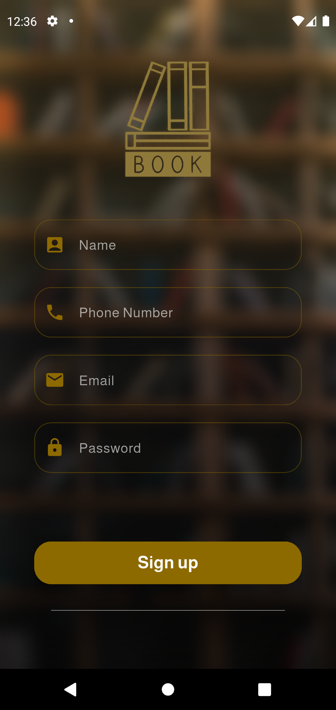
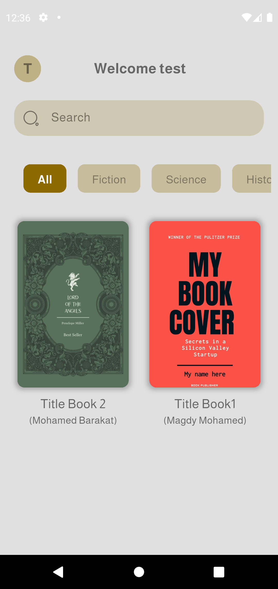
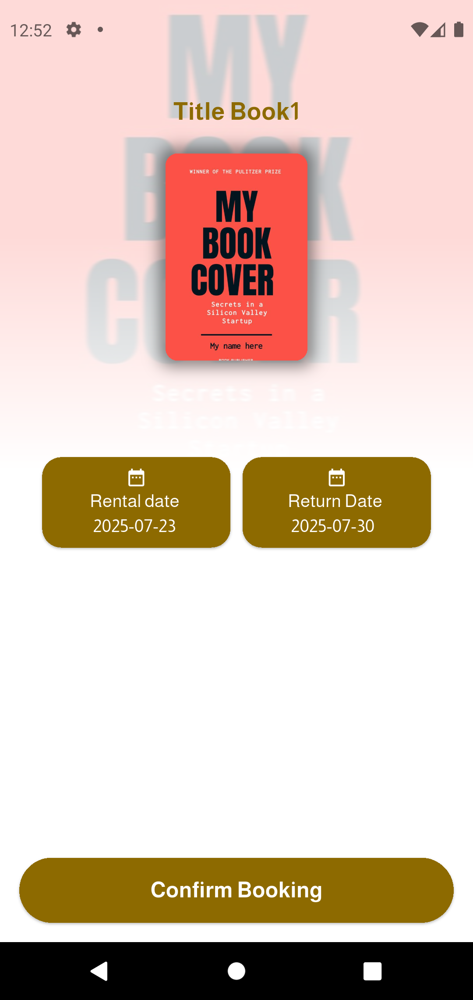
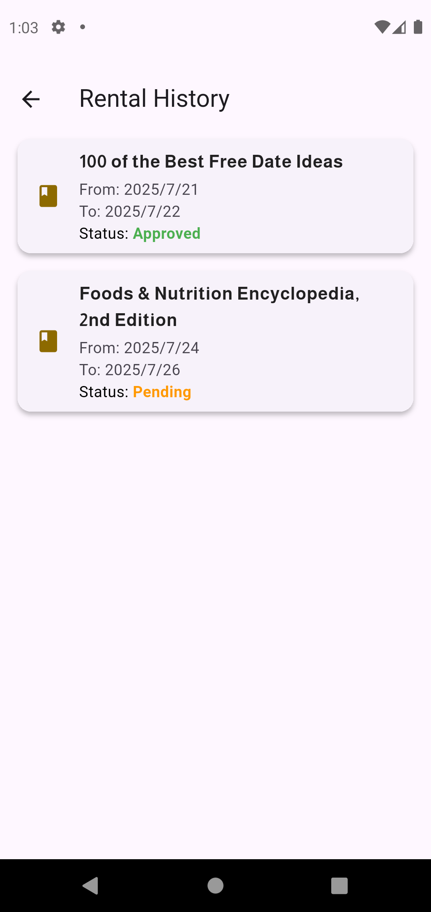
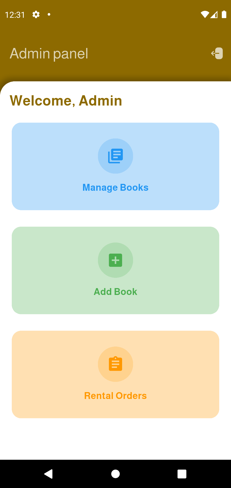
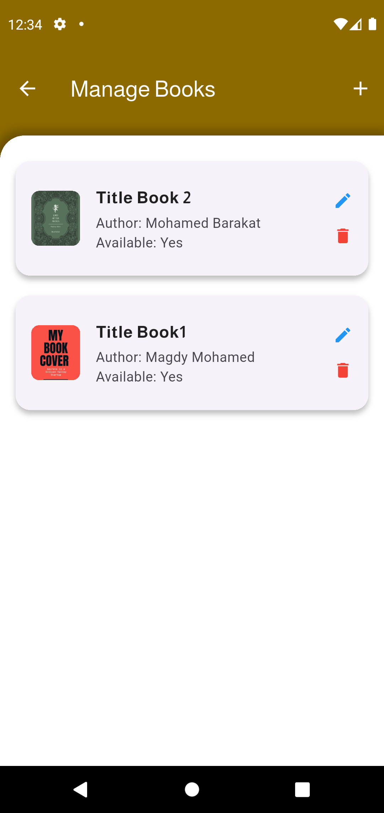
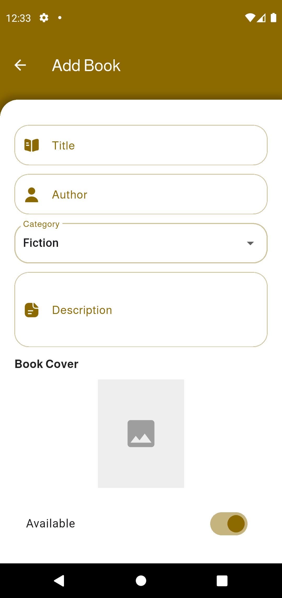
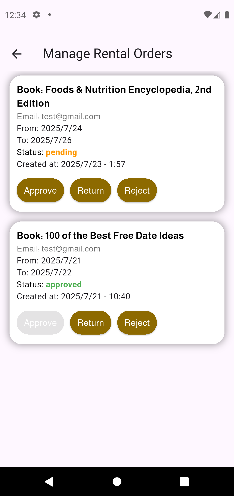

# 📚 Bookify App - Flutter

This Flutter application is a full-featured **Book Recommendation and Rental System** built for a technical challenge. It supports both user and admin roles and uses Firebase for backend functionality.

---

## 🚀 Features

### 👤 User
- 🔍 Search books by title or author
- 📚 View books by category
- 📖 Book details with rating and reviews
- ⭐ Submit, update, or remove your own rating
- 🛒 Rent available books
- ⏳ View rental history

### 🛠️ Admin
- 📋 Dashboard (AdminPanel)
- ➕ Add new books with Cloudinary image upload
- 📝 Edit existing book details
- 🗑️ Delete books
- 📦 Manage rental orders

---

## 🧠 Technologies Used

| Category        | Tech Stack                     |
|----------------|--------------------------------|
| Frontend       | Flutter                        |
| State Mgmt     | StatefulWidgets                |
| Backend        | Firebase Firestore             |
| Auth           | Firebase Authentication        |
| Storage        | Cloudinary (for book covers)   |
| Others         | HTTP, Provider (optional), Iconsax, Google Fonts, etc. |

---

## 📁 Folder Structure

lib/
├── Screens/ # All UI Screens
│ ├── HomeScreen.dart
│ ├── BookDetailsScreen.dart
│ ├── AddBookScreen.dart
│ ├── AdminEditBookScreen.dart
│ ├── AdminOrdersScreen.dart
│ └── UserRentalsScreen.dart
├── Services/ # Firebase interaction
│ ├── BooksServices.dart
│ └── RentalsService.dart
├── Utils/ # Colors, text styles, custom widgets
│ ├── MainColors.dart
│ ├── TextStyle.dart
│ └── TextFieldStyle.dart
├── main.dart # App entry point

---

## ⚙️ Firebase Configuration

This app requires:
- Firestore setup with `books` and `rentals` collections
- Firebase Authentication (email/password)
- Firestore security rules
- (Optional) Firebase Storage (not used since Cloudinary is integrated)

---

## 📷 Image Upload via Cloudinary

- Image is uploaded using HTTP Multipart request
- Cloudinary `unsigned` upload preset is used for simplicity
- Only available to admins when adding or editing books

---

## 📱 Screenshots

### Welcome Screen

  

### Sign up Screen

  

### Login Screen

  

### Home Screen

  

### Book Details

  

###  Book Rental Screen

  

### Rental History Screen

  

### Admin Panel Screen

  

### Admin Mange Books Screen

  

### Admin Add Book Screen

  

### Admin Mange Orders Screen

  

---

📅 Project Context
This app was developed as part of a technical challenge assigned to test Flutter & Firebase skills. The app is functional, well-structured, and styled for production-level use.

--- 

🧑‍💻 Developer
Mohamed Barakat
📧 Email: [mohamed.Barakat1166@gmail.com]
🔗 GitHub: [https://github.com/MagTaz]

